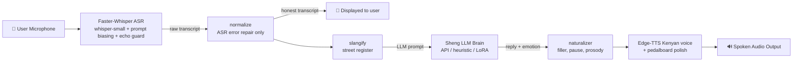

# 🇰🇪 Swahili & Sheng Speech-to-Speech (S2S) Agent

A low-latency, end-to-end **Speech-to-Speech** pipeline for **Standard Swahili and Nairobi Sheng** (Kenyan urban creole). Speak into a mic, get a spoken Sheng reply from a Kenyan neural voice.

---

## 🏗️ Architecture Flow



**The two-stage text path is deliberate.** `normalize()` only repairs what the ASR got
wrong — token splits (`ni aje` → `niaje`), phonetic corruptions (`radah` → `rada`). It
never swaps one word for another, so it is safe for display, for WER scoring, and as a
fine-tuning label. `slangify()` additionally rewrites standard Swahili into street
register (`nielekeze` → `nisho`), which **changes meaning-bearing words** — so it is
applied *only* on the way into the LLM and never reaches the UI or a training target.

---

## 📁 Project Structure

```
Sheng-TTS-model/
├── config.py                 # Paths, model sizes, voices, backend selection
├── sheng_lexicon.py          # Lexicon, ASR_CORRECTION_RULES, SHENG_SLANG_RULES, persona
├── naturalizer.py            # Fillers, pauses, follow-ups, per-emotion prosody
├── asr_engine.py             # Faster-Whisper + prompt biasing + echo guard
├── llm_engine.py             # Brain: API (default) / heuristic / local LoRA
├── tts_engine.py             # Edge-TTS Kenyan voices + pedalboard polish
├── pipeline.py               # Audio → ASR → LLM → TTS orchestrator, latency tracking
├── app.py                    # Gradio web UI
├── cli.py                    # Terminal fallback UI
├── eval_asr.py               # Batch WER/CER evaluation
├── test_pipeline.py          # Component verification suite
├── scripts/
│   ├── prefetch_models.py    # Cache Whisper weights BEFORE the demo
│   ├── generate_demo_audio.py# Demo prompts + canned fallback replies
│   └── ab_decode_config.py   # Verify decode-config fixes on real clips
├── assets/
│   ├── demo_samples/         # 6 preset demo prompts
│   └── fallback/             # 6 canned bot replies (stage safety net)
├── data_engine/              # Audio preprocessing, pseudo-labeling, cleaning
├── training/                 # Whisper + LLM LoRA fine-tuning
└── dataset/                  # Segmented clips and manifests
```

---

## ⚡ Quick Start

### 1. Install

Python **3.11** is required (`faster-whisper`/`ctranslate2` have no 3.14 wheels).

```bash
python -m venv .venv && source .venv/bin/activate   # Windows: .venv\Scripts\activate
pip install -r requirements.txt
```

`ffmpeg` must be on PATH — it is a system package, not a pip one:

```bash
winget install Gyan.FFmpeg     # Windows
brew install ffmpeg            # macOS
sudo apt install ffmpeg        # Linux
```

### 2. Prefetch models and audio — **do this the night before a demo**

```bash
python scripts/prefetch_models.py        # caches the Whisper weights
python scripts/generate_demo_audio.py    # demo prompts + fallback replies
```

Skipping this means the first mic click downloads model weights on venue wifi.

`prefetch_models.py` sets `HF_HUB_DISABLE_XET=1` for you — HuggingFace's Xet transfer
backend failed here mid-download (`CAS Client Error ... error decoding response body`)
and left a partial cache; the plain HTTP path completed fine. If the download still
will not finish, run with `WHISPER_MODEL_SIZE=small` and accept the quality drop rather
than risk downloading live.

### 3. Point the brain at an API (recommended)

```bash
export LLM_BACKEND=openai
export OPENAI_API_KEY="gsk_...your-groq-key..."
# defaults already target Groq's OpenAI-compatible endpoint + llama-3.3-70b-versatile
```

Without a key the engine falls back to the offline heuristic automatically — it never
hard-fails, it just gets shallower.

### 4. Verify, then run

```bash
python test_pipeline.py     # normalizer, TTS, LLM, ASR
python app.py               # → http://localhost:7860
python cli.py --demo        # terminal fallback if Gradio misbehaves
```

---

## 🎯 Demo Scenarios

| # | Scenario | Spoken Input |
|---|---|---|
| 1 | **Greeting & Rada** | *"Niaje chief, form ni gani leo mtaani?"* |
| 2 | **Work & Hustle** | *"Hustle inaendeleaje leo chief?"* |
| 3 | **Kibanda Lunch** | *"Niko na chwani nataka kubuy lunch, unapendekeza nini?"* |
| 4 | **Nganya to Tao** | *"Nisho pahali keja yako iko ndio nipande nganya tao."* |
| 5 | **Weekend Vibes** | *"Hii weekend form iko wapi?"* |
| 6 | **Luku & Drip** | *"Hizo viatu mpya zinakutoa aje?"* |

Bot replies are **not** fixed — every heuristic intent carries 3–4 variants, and
`naturalizer.humanize()` adds a filler, a breath pause, and sometimes a follow-up
question, so repeating a scenario does not reproduce identical audio.

---

## ⚠️ Known Limitations

Read this before promising anything about accuracy.

### ASR is the weak half, and it is a data problem

On the only human-referenced evaluation we have (`results_baseline.csv`, 123 clips,
`whisper-small` + sentence-form prompt biasing):

| Metric | Value |
|---|---|
| Median WER | **1.00** |
| Mean WER (valid references) | 1.94 |
| Clips with WER ≤ 0.3 | **0 / 123** |
| Best single clip | WER 0.40 |

**Zero clips of hand-verified transcription exist in this repo.** The 349-clip
`dataset/validation_manifest.jsonl` is labelled `CLEAN_VALID`, but `clean_sheng_text`
is byte-identical to `normalized_sheng` for all 349 records — it is regex output, not
human correction. No Whisper fine-tune should be attempted on it: training on
pseudo-labels teaches the model to reproduce its own errors.

Two decoder-level bugs contributing to the above have been fixed (see below), but they
are not the whole gap. Closing it requires hand-verified transcripts.

**The normalizer does not help real speech.** On those same 100 human-referenced clips,
*zero of the 61 correction rules fire* — mean WER is 1.992 both with and without it.
The rules were written from the six TTS demo phrases and match only those. Mining the
real data for better rules (`scripts/derive_correction_rules.py`) finds **0 recurring
substitutions out of 30**: Whisper's failures here are whole-utterance, not
token-level, so no regex layer can repair them. `normalize()` is worth keeping — it is
lossless and does help the rehearsed demo phrases — but it is not an accuracy feature,
and any "5x improvement" figure measured on the demo set should not be quoted.

### The evaluation set is not in the repo

`eval_asr.py` reads `zoza_transcripts/mapped_data`, which was never committed. It is the
only human-transcribed Sheng data the project has and it currently exists on one
laptop. **Commit it or back it up.**

### What was fixed, and what that does not fix

- **Prompt leakage.** `WHISPER_SHENG_PROMPT` is a fluent sentence, which Whisper
  regurgitated verbatim as the transcript on 16/123 baseline clips (13%). Handled by a
  post-decode echo guard in `asr_engine.py` — 11/16 caught, 0 false positives.
  A bare word-list prompt was tried as the fix and **reverted**: it measured worse
  (WER 0.741 vs 0.699) because the decoder copies the prompt's *format*, yielding
  list-shaped transcripts at 5x the comma density. See `scripts/ab_prompt_bias.py`.
  Four of the five uncaught leaks are the string "Niaje chief, form ni gani leo
  mtaani?", which is simultaneously a leak and a correct transcript — inseparable.
- **Repetition loops.** `temperature` was a scalar `0.0`, which leaves
  `compression_ratio_threshold` with no hotter temperature to retry at — so detected
  garbage was kept anyway (one clip: "Ha ha ha" ×67, WER 44.6). It is now a fallback
  tuple.
- **Model: stayed on `small`, measured.** `large-v3-turbo` was tried and is worse
  here. On the six demo clips it had better *raw* WER (0.593 vs 0.699) yet worse
  end-to-end WER (0.376 vs 0.139) and ran 4.2x slower (14.88s vs 3.58s per clip,
  RTF 4.52 vs 1.09). Two causes: it cannot keep up with real time on CPU, and
  `ASR_CORRECTION_RULES` are tuned to the errors *`small`* makes, so they do not
  fire on turbo's different mistakes and it never gets the ~5x normalizer gain.
  **The correction rules are coupled to the model** — changing `WHISPER_MODEL_SIZE`
  invalidates them. On a GPU, turbo's better raw WER would likely win; re-derive
  the rules first.

These remove specific failure modes. They do not make the transcriber reliable on
open-ended conversational Sheng.

### Other limits

- **Latency.** CPU-only inference runs well over the 3s glass-to-glass target; the
  baseline averaged 6.8s/clip on `small`. A GPU, or shorter utterances, is the fix.
- **The local LoRA is a template matcher.** `llm_sheng_lora_output_1_5B/` is
  Qwen2.5-1.5B trained on 2,500 turns (train 0.152 / eval 0.163) — strictly better than
  the old 0.5B-on-150, which memorised verbatim. It produces fluent, varied Sheng and
  answers the rehearsed demo prompts well. But ask it something off-script and it maps
  to the nearest template: *"Nimepoteza simu yangu kwa mathree, nifanye nini?"* gets
  *"Kibanda ya mama tao iko open, nyama choma iko tayari."* The 2,500 records come from
  only ~320 skeleton pairings, so the diversity is surface-level. **Prefer the API
  backend** for anything but an offline demo. See `AUDIT_RESULTS.md` §10.
- **`dataset/*.jsonl` carries absolute Linux paths** (`/home/ray/...`). Use the
  `relative_path` field, which resolves correctly on any machine.
- **Sheng is generational and neighbourhood-specific.** The lexicon reflects one
  register; vocabulary from a different age group or estate will not be covered.

---

## 🔁 Stage Fallback Order

If something breaks during a live demo, in this order:

1. **LLM fails** → happens automatically; the engine drops to the offline heuristic.
2. **ASR garbage** → switch the backend dropdown to heuristic and type input via `cli.py`.
3. **Pipeline dies** → play `assets/fallback/*.mp3`, the six canned replies.
4. **Gradio won't load** → `python cli.py --demo`.
