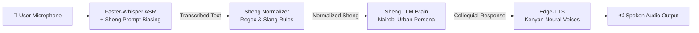

# 🇰🇪 Swahili & Sheng Speech-to-Speech (S2S) Agent

A lightweight, low-latency, end-to-end **Speech-to-Speech (S2S)** pipeline designed specifically for **Standard Swahili & Nairobi Sheng** (Kenyan urban creole).

---

## 🏗️ Architecture Flow



1. **ASR (Speech-to-Text)**: `faster-whisper` with contextual prompt conditioning using ~50 core Sheng keywords.
2. **Sheng Normalizer**: Fast regex mapping handling colloquial spelling variants (*chapaa*, *bazenga*, *mbogi*, *rada*).
3. **Conversational LLM**: Multi-backend engine supporting offline heuristic banter, OpenAI/Groq/Ollama, or Gemini API.
4. **TTS (Text-to-Speech)**: Microsoft Edge-TTS Kenyan voices (`sw-KE-RafikiNeural` / `sw-KE-ZuriNeural`).
5. **Interactive UI**: `Gradio` Web UI with real-time waveform input, latency breakdown, and audio playback.

---

## 📁 Project Structure

```
Sheng_pipe/
├── config.py             # System paths, models, and voice settings
├── sheng_lexicon.py      # ~80 Sheng words, normalizer rules, prompt biasing & persona
├── asr_engine.py         # Faster-Whisper ASR engine with Sheng context conditioning
├── tts_engine.py         # Kenyan neural TTS synthesizer (Rafiki / Zuri)
├── llm_engine.py         # Conversational brain (Heuristic, OpenAI, Ollama, Gemini)
├── pipeline.py           # End-to-End audio-to-audio orchestrator with latency tracking
├── app.py                # Interactive Gradio Web Application
├── test_pipeline.py      # Automated pipeline verification test suite
├── requirements.txt      # Python dependencies
└── temp_audio/           # Temporary audio buffer directory
```

---

## ⚡ Quick Start

### 1. Install Dependencies
```bash
cd /home/ray/Desktop/Sheng_pipe
pip install -r requirements.txt
```

### 2. Run Test Suite
Verify that all components (Normalizer, TTS, LLM, ASR) are functioning:
```bash
python test_pipeline.py
```

### 3. Launch Interactive Web UI
```bash
python app.py
```
Open your browser at `http://localhost:7860` to speak with the agent!

---

## 🎯 Saturday Demo Scenarios (6 Verified Tracks)

| # | Scenario | Sample Spoken Input | Bot Spoken Response |
|---|---|---|---|
| 1 | **Greeting & Rada** | *"Niaje chief, form ni gani leo mtaani?"* | *"Form ni kuchill tu kejani na mbogi, tukipiga stori za luku na hustle. Rada yako?"* |
| 2 | **Work & Hustle** | *"Hustle inaendeleaje leo chief?"* | *"Kazi inasonga fiti sana chief, tunang'ang'ana kusaka dooh bila kuogopa!"* |
| 3 | **Kibanda Lunch** | *"Niko na chwani nataka kubuy lunch, unapendekeza nini?"* | *"Hiyo chwani utapata chapo mbili safi na madondo kwa kibanda ya mtaa. Utashiba fiti sana!"* |
| 4 | **Nganya to Tao** | *"Nisho pahali keja yako iko ndio nipanda nganya tao."* | *"Panda tu nganya pale stage, shuka tao alafu unisho kwa simu nikupe rada safi ya street!"* |
| 5 | **Weekend Vibes** | *"Hii weekend form iko wapi?"* | *"Weekend ni kupika luku, kutokea pale alchemist na kuparty like there is no tomorrow!!"* |
| 6 | **Luku & Drip** | *"Hizo viatu mpya zinakutoa aje?"* | *"Hizo raba zimepiga luku hatari msee, unakaa chief mwenyewe!"* |

